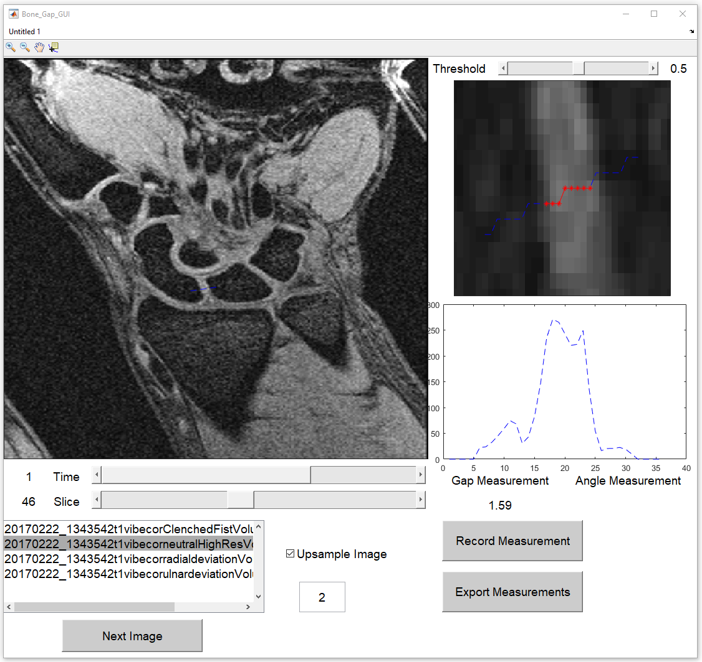

# Bone Gap Measurement Tool

# How To Run

  - Right click on "Bone_Gap_GUI.m" and click Run
  - Or open "Bone_Gap_GUI.m" and click "F7" on your keyboard
  - The popup will ask for a folder containing .nii or .img/.hdr images

# Visualization
- Use the time and slice slider to selec the desired 2D image
- To adjust the constrast and brightness hold the *right mouse button* over the image and move the mouse
- Alternatively, hold *shift+left* mouse click to adjust the contrast and brightness

# Measurements
  - Press **Space Bar** to begin a measurement
  -- 2 clicks are for the bone gap measurement
  -- 3 clicks for an angle measurement
- Adjust the **Threshold** slider to achieve a good bone gap measurement (will appear as a red line and dots on the zoomed in image)
- Click on **Record Measurement** to record the current measurement

# Export
  - Click on **Export Measurement** to export to Excel
  - It will append the **Output_Measures.xlsx** file with the new measurements
  - Recommend to delete the old **Output_Measures.xlsx** file before resaving

